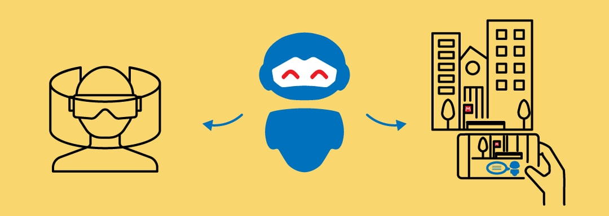
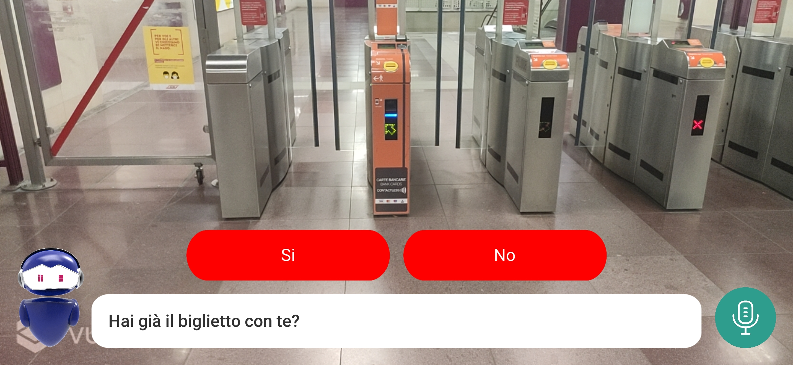
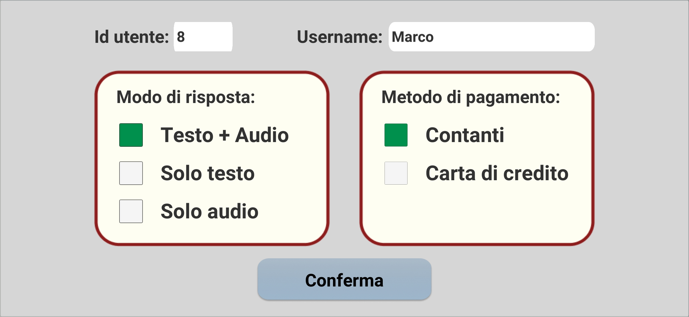
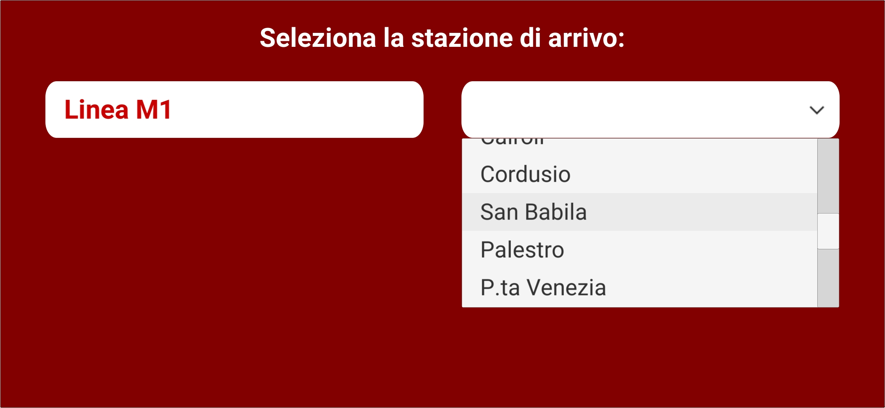
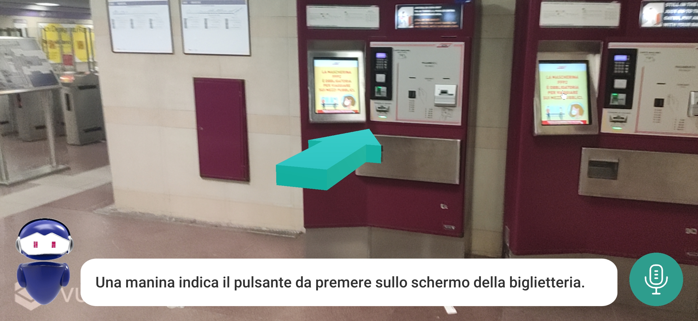
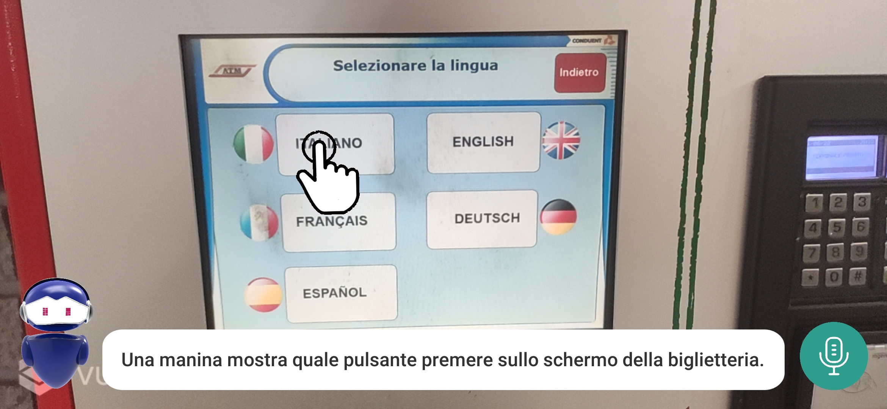
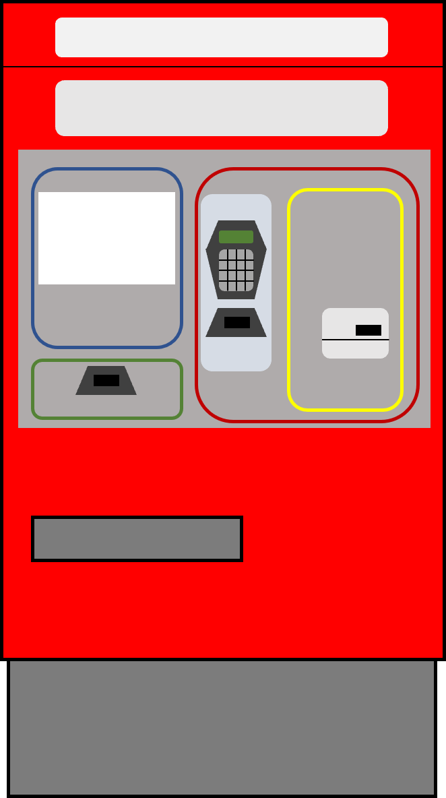
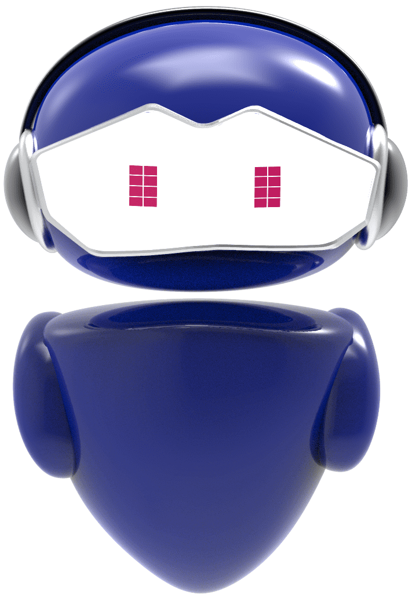

# 5AAR-Subway

## Introduction
Autism Spectrum Disorder affects the way an individual communicates, perceives, and interacts with the world through social interactions, communication, restrictive behavior patterns, and sensory sensitivity. And it has an impact on independence in daily activities. There is no one size fits all approach, but the routine is essential, and the program should be sustainable and ecological (but this is not always the case).

This project is part of a wider project, called [5A][1] ("Autonomie per l’Autismo Attraverso realtà virtuale, realtà Aumentata e Agenti conversazionali"), which aims to help autistic people to acquire the necessary social and practical skills to develop their autonomy in everyday life contexts, using Virtual Reality, Augmented Reality and Conversational Agents.

This project, in particular, deals with the subway use case scenario, combining Augmented Reality and Conversational Agents. 

## Design

### Task flow
The flow of tasks the user has to accomplish in the system is the following:
1. Find the ticket machine, and purchase the ticket,
2. Find the turnstile and pass it,
3. Find the correct direction sign to follow,
4. Reach the platform, and finally,
5. Enter the train and reach the destination.
  

### Interactions
The possible interaction available to the user are:
- Recognize a target, with the smartphone’s camera,
- Communicate with the virtual assistant. This, in turn, can be done in 3 different ways:
	- Through the microphone,
	- Through the conversation buttons (to answer a question),
	- Clicking the avatar button (to ask for help).
  

From this, the designed interface is the following:

- On the bottom left corner, there is the avatar button, used as a shortcut to ask for help to the virtual assistant,
- in the middle, there is the text box containing the textual response from the assistant,
- over the text box are deployed the conversation button, used as a shortcut to answer questions,
- on the bottom right corner, there is the microphone button, used for the usual conversation.
  

### Tutorial
In the application, a tutorial has also been included. It has been divided into two parts:
- The first part is an explanation of the available interaction using screenshots,
- The second part is a hands-on activity to try the main interactions (recognize a target, use the microphone buttons).
  

### Configuration
The system is configurable in two ways:
- through a Settings screen to set user ID, username, favorite assistant’s response medium, and favorite payment method,

- through some configuration screens to set the line, starting station and destination station of the travel.

  

### Transmedial elements
The graphical elements used in the AR experience are called "transmedial elements", because they are used to keep a continuum between the VR experience and the AR experience of 5A.
Among them we can find:
- The attractors, which are 3D or 2D virtual shapes that dynamically appear on the screen and aim at guiding the attention of the user on a specific point that they are seeing through their device’s camera,

- The facilitators, which are digital cues that help the user to remember elements learned in the previous VR context, but that they are not able to correctly recall in the AR experience,

- The virtual assistant’s avatar, which is, from a methodological point of view, the most important transmedial element.

## Implementation
The AR experience has been developed using [Unity](2), a powerful tool, employed to create software for mobile devices, with a primary scripting API in C#:
- To recognize the targets, we used the Model recognition service and the Image recognition service, two services provided by the [Vuforia](3) engine, but the pictures used by the engine to generate the targets are downloaded at runtime, instead of being deployed at compile time in the app, mainly due to the ease of the maintenance, in terms of modifying, removing, and adding additional versions of the image targets already present,
- To translate the user's speech into a text that could be sent to the server, we used the [Microsoft Azure Speech-to-text service](4), also known as "speech recognition“, while to make the virtual assistant "speak", we used the [Microsoft Azure Text-to-speech service](5), also known as "speech synthesis“.
  

The application has been developed for mobile devices, in particular for Android smartphone in the list of the [Vuforia recommended devices](6), and with:
- A working rear camera, to frame the environment,
- A working GPS antenna, for the initial starting station suggestion,
- A working microphone to communicate with the assistant by voice.

[1]: https://5a.polimi.it/ "5A"
[2]: https://docs.unity.com/ "Unity"
[3]: https://developer.vuforia.com/ "Vuforia"
[4]: https://docs.microsoft.com/en-us/azure/cognitive-services/speech-service/speech-to-text "Microsoft Azure Speech-to-text service"
[5]: https://docs.microsoft.com/en-us/azure/cognitive-services/speech-service/text-to-speech "Microsoft Azure Text-to-speech service"
[6]: https://library.vuforia.com/platform-support/recommended-devices "Vuforia recommended devices"
